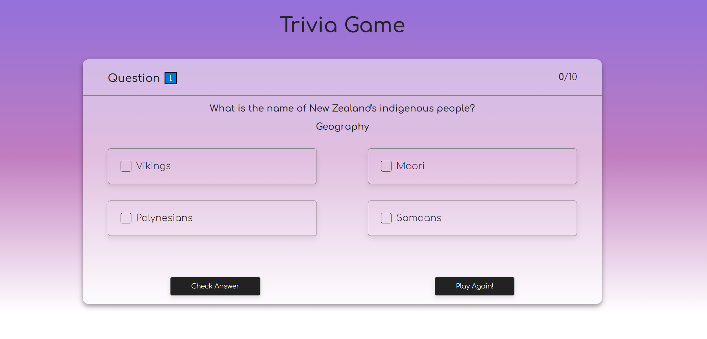

"# webApi-trivia-hack" 

A trivia game utilizing questions sourced from the Open Trivia Database API. This quiz API offers various categories such as science, sports, entertainment, geography, history, and politics, presenting multiple-choice questions randomly for quizzes. Users earn scores for correct answers and are shown the correct solution for incorrect ones. Upon completion of all 10 questions, users can choose to play again.

